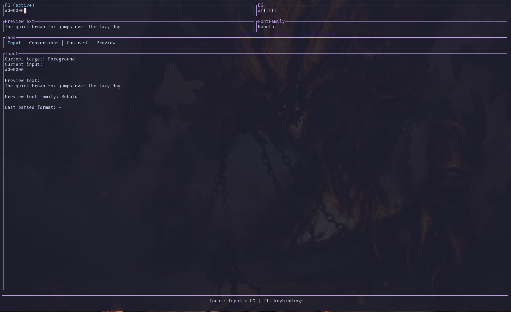

# dd_wcag

Terminal WCAG 2.x + APCA contrast checker and SCSS palette builder.

**[Illustrated tutorial](docs/tutorial.html)** — setup, install, Contrast, Fix, Palette, theming, and how to refresh the screenshots.



## Quick start

```bash
curl -fsSL https://raw.githubusercontent.com/ldnddev/dd_wcag/master/install.sh | bash
dd_wcag
```

The installer detects OS and CPU, downloads the matching GitHub Release package when one exists (Linux glibc x86_64/arm64, macOS Intel/Apple Silicon), and puts the binary in `~/.local/bin`. Alpine/musl and unpublished targets fall back to a cargo build. A default theme is copied to `~/.config/ldnddev/` only if that file is missing. Pin a release with `--version`, or force a cargo build with `--from-source`:

```bash
curl -fsSL https://raw.githubusercontent.com/ldnddev/dd_wcag/master/install.sh | bash -s -- --version v0.5.0
curl -fsSL https://raw.githubusercontent.com/ldnddev/dd_wcag/master/install.sh | bash -s -- --from-source
```

From a local checkout (builds with cargo):

```bash
./install.sh
dd_wcag
```

Uninstall:

```bash
./install.sh -uninstall
# or, without a checkout:
curl -fsSL https://raw.githubusercontent.com/ldnddev/dd_wcag/master/install.sh | bash -s -- -uninstall
```

Developers can still run the TUI without installing:

```bash
cargo run
```

## What it does

- Check one foreground/background pair against **WCAG** (AA or AAA) and **APCA** (Lc45 / 60 / 75 / 90)
- Size 6–120px, weight 100–900, style chips, live conversions (hex / rgb / hsl)
- Fix pane nudges OKLab lightness toward a passing candidate
- Browser preview (`Ctrl+O`) at `/tmp/dd_wcag_preview.html` for true CSS pixel size
- Palette builder from Primary / Secondary / Tertiary (optional Support) → WCAG-gated `_palette.scss`

## Everyday keys

| Key | Action |
|---|---|
| `1` / `2` | Contrast / Palette |
| `Tab` / `Shift+Tab` | Next / previous control |
| `Ctrl+G` | Generate palette |
| `Ctrl+F` | Toggle Fix |
| `Ctrl+O` | Open browser preview |
| `Ctrl+S` | Contrast: cycle style · Palette: save SCSS |
| `Ctrl+C` | Contrast: copy hex · Palette: copy SCSS |
| `F1` / `F2` | Keys & mouse · Theme inspector |
| `Esc` | Blur / close popups (does not quit) |
| `Ctrl+Q` | Quit |

Theme lookup: `./dd_wcag_theme.yml`, then `~/.config/ldnddev/dd_wcag_theme.yml`, then built-in defaults (`version: 1` required).

## Docs

- [Tutorial](docs/tutorial.html) — user guide with screenshots
- [SPEC.md](SPEC.md) — product spec
- [THEME_STRUCTURE_STANDARD.md](THEME_STRUCTURE_STANDARD.md) — shared ldnddev theme schema
